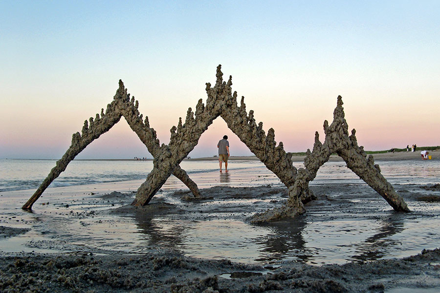
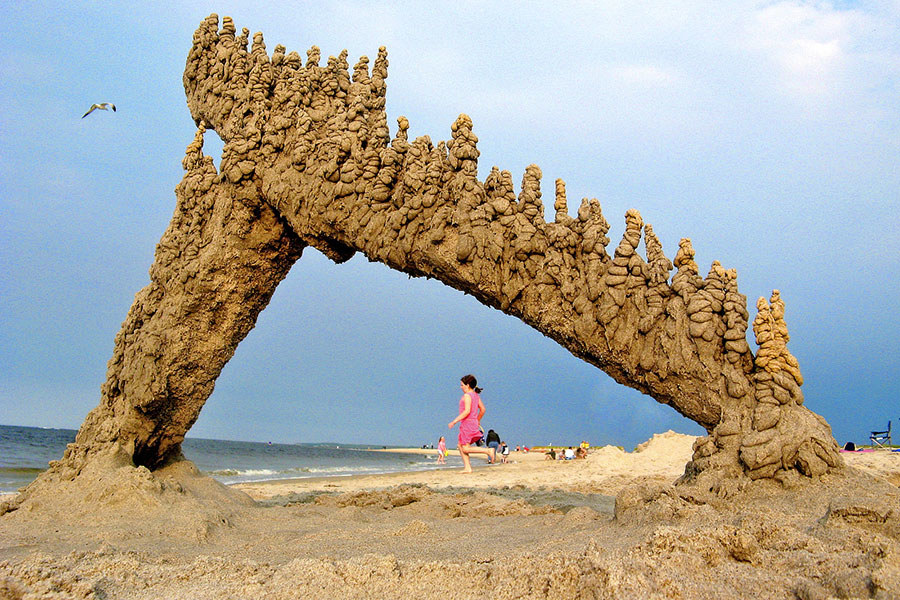

  These amazing works of art were completed by Massachusetts resident Matt Kaliner.The process is simple, Kaliner says. “Grab a handful of very wet sand, and let it slide through your fingers. It naturally forms these nice Gothic towers. Let that dry a little, drip more sand, and repeat until you’re satisfied.”
  
  
  
  “Sometime around 2004, I realized that I could take a piece of driftwood, drip wet sand onto it, and produce a whole range of interesting and different shapes,” Kaliner adds. 
  
  
  
  “Over time, I started to use string, fishing line, anything I could find on the beach,”
  
  
  
(Architectural Digest)
